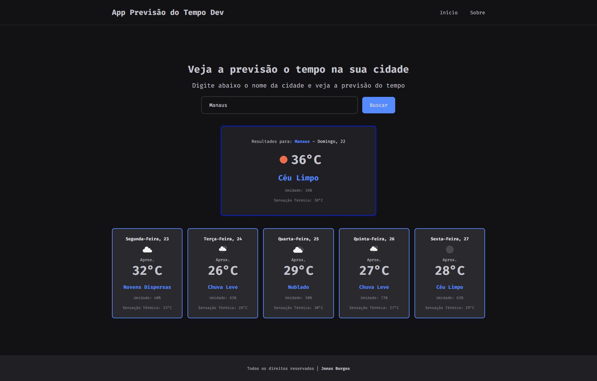

<h1 align="center"> APP Previsão do Tempo DEV</h1>

Descubra a previsão do tempo da sua cidade

  

## 🖥️ Projeto

O App é um sistema para descobrir a previsão do tempo utilizando a API do OpenWeather, onde o usuário digita a cidade e aparece a previsão do dia atual e dos próximos 5 dias. [desse link](https://devclubjonasappprevisaodotempo.netlify.app/).

## 🚀 Tecnologias

Esse projeto foi desenvolvido com as seguintes tecnologias:

&nbsp;
&nbsp;
&nbsp;
&nbsp;
&nbsp;
&nbsp;
&nbsp;
&nbsp;

## ❤ Agradecimentos

Esse projeto foi realizado após ver um vídeo do canal [DevClub](https://www.youtube.com/@canaldevclub). Caso tenha interesse em assistir o vídeo, [acesse aqui](https://www.youtube.com/watch?v=1mm_C-t_Vyg)

## 💬 Me encontre nas redes

